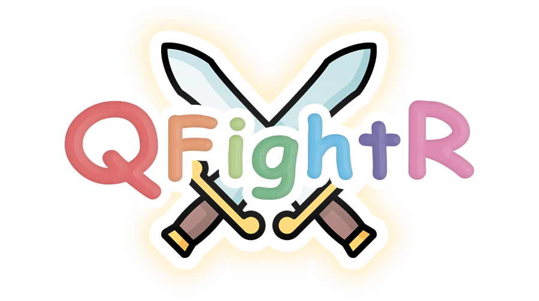

# Représentation du jeu QfrightR
Nous avons créer un nouveau jeu de société QfrightR. Ce site web vous permet de savoir la conpcetion de notre jeu, comprendre les règles et retrouver les cartes necessaires pour jouer.

## Vous pouvez visualieser ce site en ligne à l'adresse suivante
[qfrightr]https://wweishen.github.io/qfightr/

'''html
<!DOCTYPE html>
<html>
  <head>
    <!-- <link rel="stylesheet" type="text/css" href="screen.css"> -->
    <meta charset="UTF-8">
    <meta name="viewport" content="width=device-width, initial-scale=1">
    <link rel="stylesheet" type="text/css" media="screen and (min-width : 650px) " href="screen.css"> <!-- grand -->
    <link rel="stylesheet" type="text/css" media="screen and (max-width : 650px) " href="print.css"> <!-- petit -->

    <title>Présentation du jeu</title>
  </head>
  <body>
    

      <ul id="menu">
        <li><a href="#description">Description du jeu</a></li>
        <li><a href="#regles">Règles du jeu</a></li>
        <li><a href="#cartes">Cartes du jeu</a></li>
        <li><a href="#contact">CONTACT</a></li>
      </ul>
    

    
    

      
    

    
  
      <h1 class="titre" id= "description"> Description du jeu</h1>
      
ecrire ici

    

    
    
  
      <h1 class="titre" id= "regles"> Règles du jeu</h1>
      
ecrire ici

    

    
    
    
      <h1 class="titre" id= "cartes"> Cartes du jeu</h1>  
      
<a href="carteExemple.png">Vous pouvez télécharger les cartes en cliquant ici</a>

    

    
    
      <h1 class="titre" id= "contact"> CONTACT</h1>
      
<a href="mailto:qfightr@exemple.com">Vous pouvez nous contacter en cliquant ici</a>

    

  </body>
</html>
