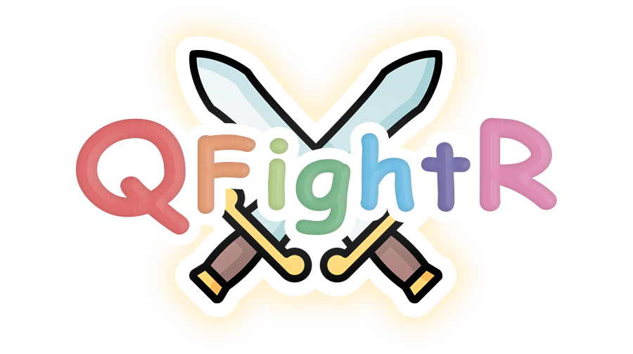

<html>
  <head>
    
    <meta charset="UTF-8">
    <meta name="viewport" content="width=device-width, initial-scale=1">
    <link rel="stylesheet" type="text/css" media="screen and (min-width : 650px) " href="screen.css"> 
    <link rel="stylesheet" type="text/css" media="screen and (max-width : 650px) " href="print.css">

    <title>Présentation du jeu</title>
  </head>
  <body>
    

      <ul id="menu">
        <li><a href="#description">Description du jeu</a></li>
        <li><a href="#regles">Règles du jeu</a></li>
        <li><a href="#cartes">Cartes du jeu</a></li>
        <li><a href="#telechargement">Téléchargement</a></li>
        <li><a href="#contact">Contactez-nous!</a></li>
      </ul>
    

    
    

      
    

    
  
      <h1 class="titre" id="description"> Description du jeu</h1>
      

        QfightR, le jeu de société sur smartphone ! 
          
        Vous voulez jouer à un jeu de société en famille ou entre amis mais vous n'en avez pas sous la main ? 
        QfightR est la solution : Un jeu de combat que vous pouvez télécharger avec des cartes pour jouer que vous pouvez imprimer.
          
        Nous avons conceptualisé un jeu de société qui conserve une structure de jeu traditionnelle :      
        une pile de défausse/pioche (même tas) et un nombre défini de cartes dans les mains des joueurs.
        L’étiquette de “Pionnier” que notre jeu porte se doit au plateau de jeu. Étant donné qu’un dispositif électronique 
        (smartphone ou tablette) remplira cette fonction, la totalité des cartes comporte un QR code qui permettra d'intéragir avec le 
        “Plateau”. 
        
      

    

    
    
  
      <h1 class="titre" id= "regles"> Règles du jeu</h1>
      
La partie se déroule sur un champ, elle comprend de 2 à 8 joueurs et le nombre de tentes dépendra du nombre des joueurs : il y aura 2 tentes vides en plus.
          
        Il existe trois catégories de cartes:
        <ol>
          <li class="normal">
            La première désigne les tentes (vous pourrez situer ces dernières à côté du dispositif) Un premier visuel sur le plateau accompagné de 6 cartes tentes.
          </li>
          <li class="normal">
            La seconde désigne les attaques et les défenses (ces cartes doivent être dans les mains des joueurs et dans la pile de défausse).
          </li>
          <li class="normal">
            Et la troisième désigne les avatars. Il y aura un maximum de huit cartes et chacune représentera un avatar unique que les joueurs choisiront pour jouer (ces cartes seront également dans les mains des joueurs).
          </li>
        </ol>
      

      

        Chaque carte physique aura un QR code unique. Les joueurs doivent pointer le QR code de la carte vers la caméra frontale du média électronique. Le système enregistrera automatiquement la valeur correspondante et affichera l'animation adéquate.
          
        Après avoir sélectionné un personnage, le joueur sera positionné aléatoirement dans l'une des tentes. Les joueurs, à tour de rôle, utiliseront une et une seule des cartes de leur main (attaque ou défense) afin d’effectuer les actions correspondantes sur la tente désignée. Le joueur qui se trouve dans la tente choisie, reçoit l'action correspondante. Lorsqu'il ne reste qu'une seule personne sur le plateau, le gagnant est généré et le jeu se termine. 
          
        Les deux tentes vides servent à déstabiliser le joueur au moment de choisir la tente à attaquer. Si celle-ci est vide, il aura perdu de l'énérgie pour rien 😈 .
          
        Pour pouvoir utiliser une arme, il faut avoir l'énergie suffisante. L'énergie se gagne à chaque début de tour du joueur. Chaque joueur gagne +1 point d'énergie à chaque début du tour.
          
        Lorsque le joueur se défend, différentes valeurs de défense sont générées selon le bouclier (cartes catégorie 2). La valeur de défense peut compenser l'attaque des autres joueurs, réduisant ainsi la perte de ses points de santé.
          
        Chaque joueur a 3 vies et chacune d’entre elles est composée de 5 PS (Points de Santé). Quand un joueur perd ses 3 vies alors il est alors éliminé. Le dernier joueur vivant est le gagnant 👑.               
      

    

    
    
    
      <h1 class="titre" id= "cartes"> Cartes du jeu</h1>  
      
<a href="CARDS.pdf">Vous pouvez télécharger les cartes en cliquant ici</a>

    

    
 
      <h1 class="titre" id= "telechargement"> Lien pour télécharger le jeu</h1>
      
<a href="lienExemple.png">Vous pouvez télécharger le jeu en cliquant ici</a>

    

    
    
      <h1 class="titre" id= "contact"> Contactez-nous!</h1>
      
<a href="mailto:qfightr@exemple.com">Vous pouvez nous contacter en cliquant ici</a>

    

  </body>
</html>